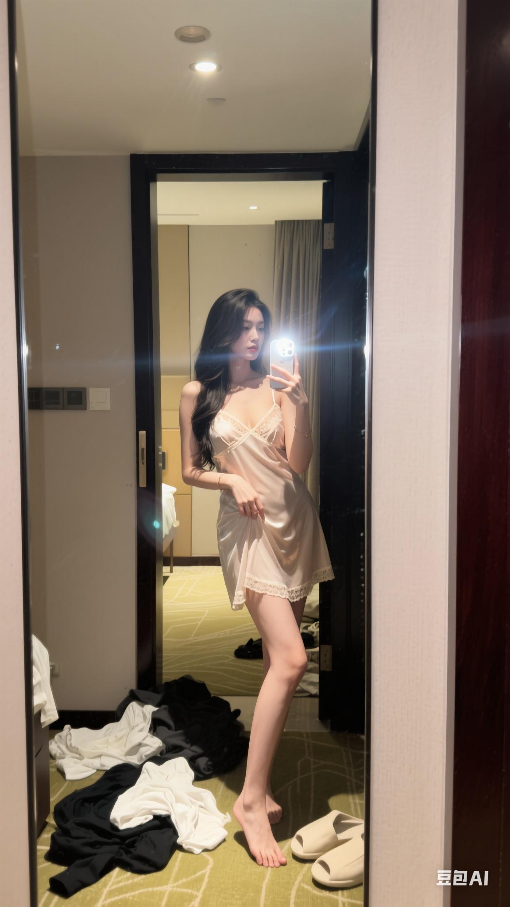

<a id="readme-top"></a>
# Awesome Doubao Images ✨

[](README_en.md)
[](README.md)
<a href="https://github.com/zhangheli/awesome-doubao-images/stargazers">
  
</a>

🎉 欢迎来到 Doubao 图片精选！

这是一个精选的 Doubao 与 jimeng 生成图像与提示词合集。借助 Doubao 和 Jimeng，全面展示 Bytedance 在 AI 图像生成方面的前沿能力，并不断探索创意表达的新可能。

案例主要来源于 Twitter/X 🐦 和 Jimeng 社区 🎬，希望这些案例能为您带来启发 💡，为你的灵感加速 🚀。

<strong>→ 喜欢就点 Star 支持！ / Smash that ⭐ if you like it!</strong>


---

<a id="table-of-contents"></a>
## 目录

- [🎨 Doubao介绍](#doubao-intro)
- [📖 案例目录](#cases-toc)
- [🛠️ 工具介绍](#tools-intro)
- [💡 提示词技巧](#prompting-tips)
- [🤝 如何贡献](#how-to-contribute)
- [🙏 致谢](#acknowledgements)
- [🌟 Star历史](#star-history)


---

<a id="doubao-intro"></a>
## 🎨 Doubao 介绍

DOubao 是 ByteDance 最新的多模态大模型，既能以文本提示一键生成高质量图片，也支持图生图编辑，涵盖局部修改、风格转换及多图融合等高级操作。

- 🧠 多模态：同时解析文本、图像，精准把握创作意图
- ✍️ 精准出图：支持复杂提示词，快速生成高质量图像
- 🎨 多样风格：吉卜力、厚涂、像素、3D 毛绒等任你选
- 🖼️ 真实构图：空间、透视、光影自然可信
- ✏️ 易于再编辑：替换背景、改细节，二次创作无压力
- ⚡️ 极速交互：响应更快，适合实时创意迭代


---

<a id="cases-toc"></a>
## 📖 案例目录

*   [案例 1：人像摄影，日常快照风格 (by @remixdesigne)](#cases-1)

---

<a id="cases"></a>
## 🧩 案例

<a id="cases-1"></a>
### 案例 1：人像摄影，日常快照风格 (by [@remixdesigne](https://x.com/remixdesigne))

[原文链接](https://x.com/remixdesigner/status/1923163958867038238)



**提示词**

```
人像摄影，日常快照风格，非精心构图或打光，一位气质御姐，穿着轻薄吊带睡衣，动作为在镜子前随手自拍，场景为酒店房间，站在落地镜前，用 iPhone 后置镜头自拍，开启闪光灯，略带快门速度不够造成的运动模糊，构图随意、角度尴尬、画面不够对称或美观，画质带有日常感和粗糙感，体现「平凡无奇」，9:16 构图
```


**需上传参考图片：** 人像摄影，日常快照风格


---

[⬆️ 返回案例目录](#cases-toc)


---

<a id="tools-intro"></a>
## 🛠️ 工具介绍 

以下是可以使用 Doubao 模型生成图片的应用：

- **💬 [豆包](https://doubao.com)：** 豆包官方出品，可使用 Doubao 生成高质量图片，支持多风格、多细节控制，适合创意表达与内容创作。

- **🎬 [Sora](https://https://jimeng.jianying.com)：** OpenAI官方出品，可通过 Doubao 生成逼真图像，支持图文结合、场景重建，适用于影视、动画等视觉创意场景。


<a id="prompting-tips"></a>
## 💡 提示词技巧

1. [提示词高手们到底是怎么发现 GPT-4o 画图新玩法的？](https://baoyu.io/blog/gpt-4-image-generation-new-tricks) by [@dotey](https://x.com/dotey)
2. [Prompt Engineering (PDF)](https://s.baoyu.io/files/2025-01-18-pdf-1-TechAI-Goolge-whitepaper_Prompt%20Engineering_v4-af36dcc7a49bb7269a58b1c9b89a8ae1.pdf) by Google
3. [Prompt Engineering 简体中文翻译版](https://baoyu.io/blog/google-prompt-engineering-whitepaper) by [@dotey](https://x.com/dotey)
4. [如何轻松写出好用的提示词模板？](https://baoyu.io/blog/how-to-write-prompt-templates) by [@dotey](https://x.com/dotey)


<a id="how-to-contribute"></a>
## 🤝 贡献案例

有两种参与贡献的方式，请阅读 [CONTRIBUTING.md](./CONTRIBUTING.md)。


<a id="acknowledgements"></a>
## 🙏 致谢

本案例集的内容很大程度上依赖于 AI 社区在 Twitter/X 上分享的创意提示词和精彩视觉效果。我们向所有案例的贡献者表示诚挚的感谢。😊

特别感谢以下用户分享了他们鼓舞人心的作品 ✨：

*   [-Zho- (@ZHO_ZHO_ZHO)](https://x.com/ZHO_ZHO_ZHO)
*   [Gizem Akdag (@gizakdag)](https://x.com/gizakdag)
*   [宝玉 (@dotey)](https://x.com/dotey)
*   [balconychy(贝壳里奇) (@balconychy)](https://x.com/balconychy)
*   [Daniel (@0xdlk)](https://x.com/0xdlk)
*   [RichChat (@richardchang)](https://x.com/richardchang)
*   [歸藏(guizang.ai) (@op7418)](https://x.com/op7418)
*   [katon (@hellokaton)](https://x.com/hellokaton)
*   [Berryxia.AI (@berryxia_ai)](https://x.com/berryxia_ai)
*   [Ege (@egeberkina)](https://x.com/egeberkina)
*   [Brett (@BrettFromDJ)](https://x.com/BrettFromDJ)
*   [89'S (@M_w14_)](https://x.com/M_w14_)
*   [jiamimao 猫叔 (@jiamimaodashu)](https://x.com/jiamimaodashu)
*   [Amira Zairi (@azed_ai)](https://x.com/azed_ai)
*   [Umesh (@umesh_ai)](https://x.com/umesh_ai)
*   [Michael Rabone (@michaelrabone)](https://x.com/michaelrabone)
*   [gnrly.xyz (@gnrlyxyz)](https://x.com/gnrlyxyz)
*   [f-is-h (@f-is-h)](https://github.com/f-is-h)
*   [Madpencil (@madpencil_)](https://x.com/madpencil_)
*   [Hewar (@hewarsaber)](https://x.com/hewarsaber)
*   [Anima (@Anima_Labs)](https://x.com/Anima_Labs)
*   [terry623 (@terry623)](https://github.com/terry623)
*   [photis (Sora Profile)](https://sora.com/explore?user=user-sydD5ZkXZsDaL0BriQa010dQ)
*   [Ryan Hart (@thisdudelikesAI)](https://x.com/thisdudelikesAI)
*   以及其他可能通过转推或间接分享而被收录其提示词的创作者们。

如果您的作品被收录在此，而您希望更改署名或将其移除，请随时与我们联系。✉️

[⬆️ 返回顶部](#readme-top)


<a id="star-history"></a>
## 🌟 Star历史

[](https://www.star-history.com/#zhangheli/awesome-doubao-images&Date)

[⬆️ 返回顶部](#readme-top)

