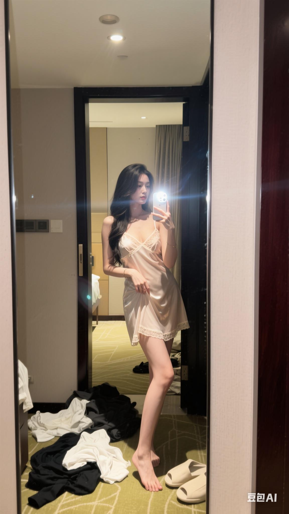

<a id="readme-top"></a>
# Awesome Doubao & Jimeng Images ✨

[](README_en.md)
[](README.md)
<a href="https://github.com/zhangheli/awesome-doubao-images/stargazers">
  
</a>

🎉 Welcome to the curated collection of images generated by Doubao and Jimeng (即梦)!

A curated collection of images and prompts generated by Doubao and Jimeng (即梦), showcasing the latest in AI image generation from OpenAI and ByteDance. Explore the stunning visuals created using Doubao and Jimeng, which showcase the AI platform's advanced image generation capabilities.

Most examples come from Twitter/X 🐦 and Doubao and JiMeng 🎬. May they spark ideas 💡 and turbo‑charge your creativity 🚀.


<strong>→ 喜欢就点 Star 支持！ / Smash that ⭐ if you like it!</strong>

---

<a id="table-of-contents"></a>
## Contents

- [🎨 What is Doubao](#doubao-intro)
- [📖 Cases Directory](#cases-toc)
- [🛠️ Tools Introduction](#tools-intro)
- [💡 Prompting Tips](#prompting-tips)
- [🤝 How to Contribute](#how-to-contribute)
- [🙏 Acknowledgements](#acknowledgements)
- [🌟 Star History](#star-history)


---

<a id="doubao-intro"></a>
## 🎨 What is Doubao

Doubao is a multimodal model that not only turns text prompts into high‑quality images but also offers image‑to‑image editing—enabling targeted retouching, style transfer, and multi‑image blending.

- 🧠 Multimodal comprehension: Simultaneously parses text and images to capture creative intent with precision
- ✍️ Accurate rendering: Handles complex prompts and rapidly produces high‑quality images
- 🎨 Diverse styles: Ghibli, painterly, pixel art, 3D plush, and more—pick your favorite
- 🖼️ Realistic composition: Spatial depth, perspective, and lighting that feel authentic
- ✏️ Easy post‑editing: Swap backgrounds, tweak details—seamless for second‑round creation
- ⚡️ Lightning‑fast interaction: Shorter response times for real‑time ideation and iteration


---

<a id="cases-toc"></a>
## 📖 Cases Directory

*   [Case 1: portrait photography，everyday snapshot style (by @remixdesigne)](#cases-1)

---

<a id="cases"></a>
## 🧩 Case

---

[⬆️ Back to Cases Directory](#cases-toc)

<a id="cases-1"></a>
### Case 1: portrait photography，everyday snapshot style (by [@remixdesigne](https://x.com/remixdesigne))

[Source Link](https://x.com/remixdesigner/status/1923163958867038238)



**Prompt**

```
Portrait photography with an everyday snapshot style, featuring a casual composition and lighting. The subject is a stylish yet sophisticated woman wearing a lightweight strapless nightgown, captured in the act of spontaneously taking a selfie while standing before a floor-length mirror in a hotel room. The scene uses the back camera of an iPhone with the flash activated, producing subtle motion blur from insufficient shutter speed. Characterized by awkward angles, asymmetrical/framing, and a composition that intentionally avoids polish or symmetry. The image quality carries a rough yet authentic everyday feel to emphasize the 'unremarkable' aspect. Captured in a 9:16 aspect ratio.
```

**Reference Image Required:** portrait photography, everyday snapshot style.


---

[⬆️ Back to Cases Directory](#cases-toc)


---

<a id="tools-intro"></a>
## 🛠️ Tools Introduction

Here are applications where you can use the Doubao and Jimeng models to generate images:

- **💬 [Doubao](https://doubao.com):** Official product by ByteDance. Generate high-quality images with support for multiple styles and detailed control, suitable for creative expression and content creation.

- **🎬 [Jimeng (Jiment)](https://jimeng.jianying.com):** Also by ByteDance, Jimeng enables realistic image generation, supporting text-image combination and scene reconstruction, ideal for visual creative scenarios like film and animation.


<a id="prompting-tips"></a>
## 💡 Prompting Tips

1. [Prompt Engineering (PDF)](https://s.baoyu.io/files/2025-01-18-pdf-1-TechAI-Goolge-whitepaper_Prompt%20Engineering_v4-af36dcc7a49bb7269a58b1c9b89a8ae1.pdf) by Google
2. [Introducing 4o Image Generation](https://openai.com/index/introducing-4o-image-generation) by OpenAI


<a id="how-to-contribute"></a>
## 🤝 How to Contribute

There are two ways to contribute, please read [CONTRIBUTING.md](./CONTRIBUTING.md).


<a id="acknowledgements"></a>
## 🙏 Acknowledgements

The content of this collection heavily relies on the creative prompts and wonderful visuals shared by the AI community on Twitter/X. We express our sincere gratitude to all contributors of these cases. 😊

Special thanks to the following users for sharing their inspiring work ✨:

*   [jamez-bondos](https://github.com/jamez-bondos/awesome-gpt4o-images)
*   [-Zho- (@ZHO_ZHO_ZHO)](https://x.com/ZHO_ZHO_ZHO)
*   [Gizem Akdag (@gizakdag)](https://x.com/gizakdag)
*   [宝玉 (@dotey)](https://x.com/dotey)
*   [balconychy(贝壳里奇) (@balconychy)](https://x.com/balconychy)
*   [Daniel (@0xdlk)](https://x.com/0xdlk)
*   [RichChat (@richardchang)](https://x.com/richardchang)
*   [歸藏(guizang.ai) (@op7418)](https://x.com/op7418)
*   [katon (@hellokaton)](https://x.com/hellokaton)
*   [Berryxia.AI (@berryxia_ai)](https://x.com/berryxia_ai)
*   [Ege (@egeberkina)](https://x.com/egeberkina)
*   [Brett (@BrettFromDJ)](https://x.com/BrettFromDJ)
*   [89'S (@M_w14_)](https://x.com/M_w14_)
*   [jiamimao 猫叔 (@jiamimaodashu)](https://x.com/jiamimaodashu)
*   [Amira Zairi (@azed_ai)](https://x.com/azed_ai)
*   [Umesh (@umesh_ai)](https://x.com/umesh_ai)
*   [Michael Rabone (@michaelrabone)](https://x.com/michaelrabone)
*   [gnrly.xyz (@gnrlyxyz)](https://x.com/gnrlyxyz)
*   [f-is-h (@f-is-h)](https://github.com/f-is-h)
*   [Madpencil (@madpencil_)](https://x.com/madpencil_)
*   [Hewar (@hewarsaber)](https://x.com/hewarsaber)
*   [Anima (@Anima_Labs)](https://x.com/Anima_Labs)
*   [terry623 (@terry623)](https://github.com/terry623)
*   [photis (Sora Profile)](https://sora.com/explore?user=user-sydD5ZkXZsDaL0BriQa010dQ)
*   [Ryan Hart (@thisdudelikesAI)](https://x.com/thisdudelikesAI)
*   And other creators whose prompts may have been included through retweets or indirect shares.

If your work is included here and you wish to change the attribution or have it removed, please feel free to contact us. ✉️

[⬆️ Back to Top](#readme-top)


<a id="star-history"></a>
## 🌟 Star History

[](https://www.star-history.com/#jamez-bondos/awesome-gpt4o-images&Date)

[⬆️ Back to Top](#readme-top)

